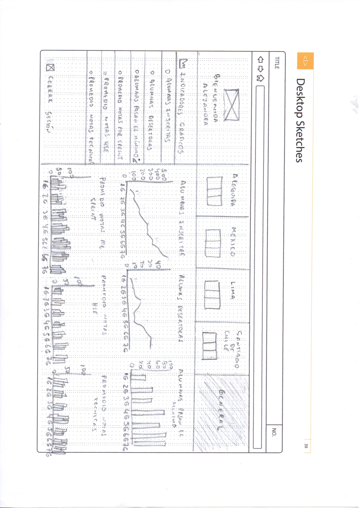
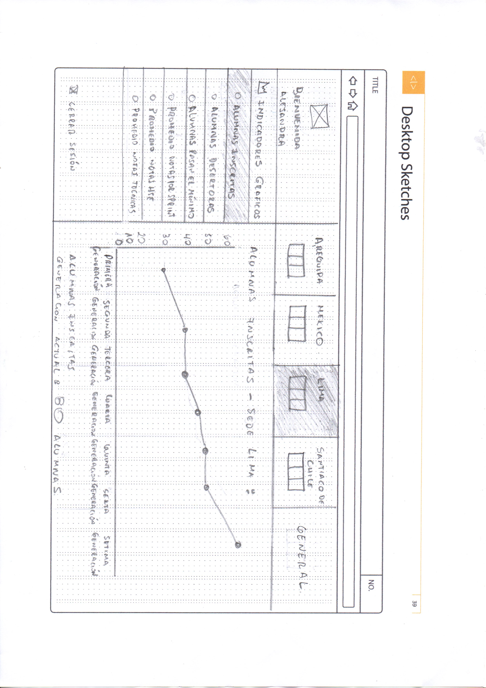

# Sketch para la herramienta del dashboard de Laboratoria

* **Curso:** _Creando tu primer sitio web interactivo_
* **Unidad:** _ Intro a User Experience Design_

***

## Objetivo

### Crea un sketch para la herramienta del dashboard de Laboratoria

El dashboard es una herramienta utilizada por profesores, training managers, directores y gerentes de Laboratoria para ver rápidamente qué está pasando en el salón de clases de Laboratoria. En el dashboard, los usuarios mencionados pueden ver rápidamente estadísticas y datos en tiempo real como:

1. Numero de alumnas inscritas
2. Numero de alumnas que desertaron
3. Numero y % de alumnas que pasan el criterio mínimo de evaluación
4. Promedio de notas por sprint
5. Promedio de notas HSE
6. Promedio de notas técnicas

Además, dado que Laboratoria tiene muchas generaciones, regularmente 2 generaciones por año (estas generaciones empezaron en el 2014), y que opera en 4 sedes (Arequipa, Ciudad de México, Lima y Santiago de Chile), es posible que los usuarios quieran ver datos de sedes / generaciones anteriores para poder hacer comparaciones.

## Desarrollo

